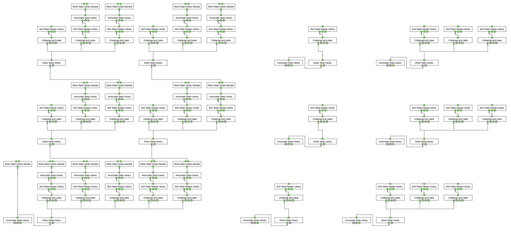

# Menagerie: A scriptable planner interface for Aquarium
Menagerie is a Python scripting interface for generating Aquarium Plans from high-level JSON descriptions.

## Contents

* [Requirements](#requirements)
* [Setup](#setup)
* [Quick Start](#quick-start)
* [Customizing Plans](docs/customizing_plans.md)

## Requirements

Menagerie requires:

* [Trident](https://github.com/klavinslab/trident)
* An Aquarium login

Menagerie is designed to be run in a Visual Studio Code [dev container](https://code.visualstudio.com/remote-tutorials/containers/how-it-works). To take advantage of this environment, you will also need to:

* Install [Docker](https://www.docker.com/get-started)
* Install [Visual Studio Code](https://code.visualstudio.com/)

Running Menagerie in this environment eliminates the need to install Trident or manage your Python version. 

## Setup
### 1. Clone Menagerie
Get Menagerie using [git](https://git-scm.com/) with the command

```bash
git clone https://github.com/klavinslab/menagerie.git
```

### 2. Open in VS Code dev container
From a new VS Code window, open the Menagerie folder. You should see a dialog at the bottom right corner of the window that says **Folder contains a dev container configuration file. Reopen folder to develop in a container (learn more).** Select **Reopen in Container**. You can also click the green rectangle at the lower left corner and select **Remote-Containers: Reopen Folder in Container** from the menu that appears at the top of the window. 

### 3. Add credentials
In order to add credentials for your Aquarium instance(s), `cp util/secrets_template.json util/secrets.json`, and add your login and url information to the new file. You can have more than two instances, and the keys (e.g., `laptop` and `production`) can be changed to whatever you want them to be.

```json
{
  "laptop": {
    "login": "neptune",
    "password": "aquarium",
    "aquarium_url": "http://localhost/"
  },
  "production": {
    "login": "your_production_username",
    "password": "your_production_password",
    "aquarium_url": "production_production_url"
  }
}
```

### 4. Install Aquarium locally in a Docker container
Menagerie and Trident are able to make far-reaching modifications to the Aquarium database, and can launch computationally expensive queries on the server. It is highly recommended that you test any new code on a local Aquarium instance. You can install a local instance running in Docker by following [these instructions](https://github.com/klavinslab/aquarium-local).

## Quick Start

### Plan a protein stability (yeast display) experiment
This section describes the steps for planning a three-round yeast display selection experiment following Gabe Rocklin's [massively parallel measurement of protein stability](https://www.ncbi.nlm.nih.gov/pubmed/28706065). It is best to run this initially on a local Dockerized instance of Aquarium. If you haven't done so already, you can find steps for installing a Dockerized Aquarium instance [here](https://www.docker.com/get-started).

Once you have Aquarium running locally, it is convenient to be able to backup and load versions of the database without having to restart the container. You can do that using the script `hot_swap_db.py` found [here](https://github.com/dvnstrcklnd/aq-hot-swap-db).

You will need to download and install three workflow libraries. You can find instructions for installing workflows [here](https://www.aquarium.bio/?category=Community&content=Importing). It is a good idea to backup the database before importing. The libraries are:

* [Standard Libraries](https://github.com/klavinslab/standard-libraries)
* [Flow Cytometry](https://github.com/klavinslab/flow-cytometry)
* [Yeast Display](https://github.com/dvnstrcklnd/aq-yeast-display)

It is also a good idea to back up the database (using a distinct file name) after importing these. 

Next, you will need to populate the database with some `Samples`. To do this, open the VS Code terminal using `^~` and run 

```bash
python util/load_test_samples.py 
```

From the browser, you should see that the following `Samples` are loaded:
```
►	8: SDO + 2% Galactose -His -Trp -Ura		
►	7: SDO -His -Trp -Ura		
►	6: Anti-c-myc-FITC		
►	5: Chymotrypsin		
►	4: Trypsin		
►	3: AMA1-best		
►	2: EBY100 + PETCONv3_baker		
►	1: DNA LIBRARY SAMPLE NAME
```

You can again back up the database (using a third distinct file name) after creating these.

Next, from the VS Code terminal, run: 
```bash
vscode@docker-desktop:/workspaces/menagerie$ python plan_protein_stability.py -t
```
Which produces the output:
```bash
RUNNING IN TEST MODE
Connected to Aquarium at http://localhost/ using pydent version 0.0.35
Logged in as Joe Neptune

Yeast Library Liquid Culture. Available afts: 
Set IO for Innoculate Yeast Library
### 1 total operations

Planning innoculation of library on 2020-03-06
Set IO for Store Yeast Library Sample
### 2 total operations

Set IO for Dilute Yeast Library
### 3 total operations

Trypsin 0
Set IO for Challenge and Label
Set IO for Sort Yeast Display Library
Set IO for Innoculate Yeast Library
Set IO for Store Yeast Library Sample
### 7 total operations
.
.
.
Created Plan: http://localhost//plans?plan_id=1
103 total operations.
96 total wires.
```
When you click on the link to the plan, you should see this:

