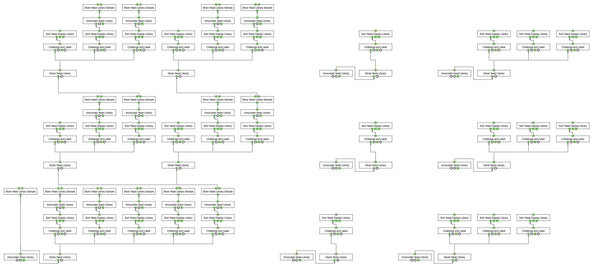

## Quick Start: Yeast Display

This section describes the steps for planning a three-round yeast display selection experiment following Gabe Rocklin's [massively parallel measurement of protein stability](https://www.ncbi.nlm.nih.gov/pubmed/28706065). 

It is best to run this initially on a local Dockerized instance of Aquarium. If you haven't done so already, you can find steps for installing a Dockerized Aquarium instance [here](https://www.docker.com/get-started).

You will need to download and install three workflow libraries. You can find instructions for installing workflows [here](https://www.aquarium.bio/?category=Community&content=Importing). It is a good idea to backup the database before importing, using the script [`hot_swap_db.py`](https://github.com/dvnstrcklnd/aq-hot-swap-db). The libraries are:

* [Standard Libraries](https://github.com/klavinslab/standard-libraries)
* [Flow Cytometry](https://github.com/klavinslab/flow-cytometry)
* [Yeast Display](https://github.com/dvnstrcklnd/aq-yeast-display)

It is also a good idea to back up the database (using a distinct file name) after importing these.

Next, you will need to populate the database with some `Samples`. To do this, open the VS Code terminal using `^~` and run 

```bash
python util/load_test_samples.py -f yeast_display_test_samples.json
```

From the browser, you should see that the following `Samples` are loaded:
```
►	8: SDO + 2% Galactose -His -Trp -Ura		
►	7: SDO -His -Trp -Ura		
►	6: Anti-c-myc-FITC		
►	5: Chymotrypsin		
►	4: Trypsin		
►	3: AMA1-best		
►	2: EBY100 + PETCONv3_baker		
►	1: DNA LIBRARY SAMPLE NAME
```

You can again back up the database (using a third distinct file name) after creating these.

Next, from the VS Code terminal, run: 
```bash
vscode@docker-desktop:/workspaces/menagerie$ python plan_protein_stability.py -t
```
Which produces the output:
```bash
RUNNING IN TEST MODE
Connected to Aquarium at http://localhost/ using pydent version 0.0.35
Logged in as Joe Neptune

Set IO for Innoculate Yeast Library
### 1 total operations

Planning innoculation of library on 2020-03-06
Set IO for Store Yeast Library Sample
### 2 total operations

Set IO for Dilute Yeast Library
### 3 total operations

Trypsin 0
Set IO for Challenge and Label
Set IO for Sort Yeast Display Library
Set IO for Innoculate Yeast Library
Set IO for Store Yeast Library Sample
### 7 total operations
.
.
.
Created Plan: http://localhost//plans?plan_id=1
103 total operations.
96 total wires.
```

You may also see warnings like these near the beginning of the output:
```
WARNING: Sample not found: SDO -His -Trp -Ura
WARNING: ObjectType not found: Yeast Library Glycerol Stock
```
This is probably fine as it is likely the result of the software looking for `Samples` and `ObjectTypes` listed in `aquarium_defaults.json` that are not in the minimal database that has been set up.

When you click on the link to the plan, you should see this:


Note that the `Plan` will not be ready to launch, because there are no `Items` in the Aquarium inventory.
